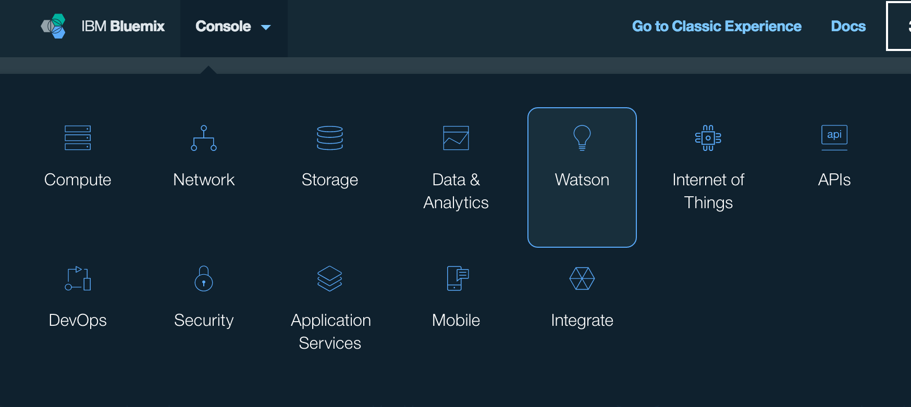

# Demo OpenWhisk.
## Scenario
A political researcher is interested in analysing political speeches to understand the personality that is being projected by the politician.

The researcher has a NoSQL database where the speeches are being stored and wants to use Watson Personality Insights service from Bluemix to analyse the speech. As a researcher, there are limited funds for this work and infrastructure cannot be purchased. Cloud is an obvious deployment target. However, the rate that speeches are added to the database is very low and the researcher does not want to pay for idle cloud resources. The analysis process should only run when a new speech is added.

## Solution
* CloudantNoSQL to store the speeches
* Watson Developer Cloud Personality Insights
* OpenWhisk to trigger events from Cloundant NoSQL and activate actions to analyse the speech.

## Implementation

### Prerequisites
* IBM Bluemix account. [Sign up](https://console.ng.bluemix.net/registration) for Bluemix, or use an existing account.
* IBM Bluemix OpenWhisk early access. [Sign up for Bluemix OpenWhisk](https://new-console.ng.bluemix.net/openwhisk).
* Install and configure the OpenWhisk command line interface [Set up OpenWhisk CLI](https://new-console.ng.bluemix.net/openwhisk/cli).
* Clone this repository
  ```bash
  $ git clone https://github.com/iwinoto/openwhisk-demo-personalityanalysis.git
  ```
* From a command line terminal, navigate to the cloned repository directory

### Bluemix web console
As of writing (1 July 2016), the Bluemix UX team is trialling a new user experience. The web interface to OpenWhisk is only available through the new experience. These instructions assume you are using the new console experience. At the time of writing, the new user experience uses the sub-doamin of `new-console`.

### OpenWhisk web console
The Bluemix web console includes a console for OpenWhisk. You can use the OpenWhisk console to create resources and to view the output of OpenWhisk triggers and actions. During this exercise you will be working in the terminal control resources but you will use the web console **Dashboard** to view the results.

### Create an instance of Personality Insights service
1. From the Bluemix web console main navigation menu, select the **Watson** category.
   
* Click on **+** in the hexagon on the top right of the main panel
* From the **Watson** category, select **Personality Insights**.
* At the bottom right of the **Personality Insights** page, select **Create** to create an instance of the service.
* In the service overview page, select **Service credentials**
* Make a note of the `username` and `password` values. You will need to set this in the `action_analyse.js` action script.

### Create a CloudantNoSQL instance
1. From the Bluemix web console main navigation menu, select the `Data & Analytics` category.
  
* Click on **+** in the hexagon on the top right of the main panel
* From the **Data & Analytics** category, select **Cloudant NoSQL DB**.
* At the bottom right of the **Cloudant NoSQL DB** page, select **Create** to create an instance of the service.
* In the service **Manage** page, select **Launch** to launch the Cloudant web console
* Create a database called `speeches`.

### Create create the actions
We need two actions. The `analyse` action will send a request to the Personality Insights service to create a personality profile from some text. The `changeListener` action will check the changes to the database and ignore database deletions.

These steps are performed in the terminal.

1. Update the `./serverless/action_analyse.js` code with the `username` and `password` values from your **Personality Insights** service
  ```javascript
  var personality_insights = watson.personality_insights({
    username: '<Your username>',
    password: '<Your password>',
    version: 'v2'
  });
  ```
* create an action to call the Personality Insights service
  ```bash
  wsk action create analyse serverless/action_analyse.js
  ```
* test action with some sample text. The service will return with a message that there is not enough text to create a profile. That's OK for now, we just want to know that the service is being called.
  ```bash
  wsk action invoke -p text "this is some text to analyse" -p language en -b -r analyse
  ```
  Use `wsk action invoke -h` to understand the command parameters.
  You will see the results of invoking the action in the command line and in the OpenWhisk web console **Dashboard**.
* Create the `speechListener` action which will fire the `newSpeech` trigger
  ```bash
  wsk action create -p namespace <Your OpenWhisk namespace> speechListener serverless/feed_newDoc.js
  ```
  The namespace is set as a default parameter to the action so it fire the right trigger. Examine the code `serverless/feed)newDoc.js` to see how its used.

### Create a trigger when a new document is added to Cloudant NoSQL
Now we have the actions we need to create triggers which represent events.

1. Make sure your OpenWhisk CLI is in the namespace corresponding to the Bluemix organization and space where your Cloudant NoSQL service instance is created. This will have been set up if you followed the [Install and configure OpenWhisk CLI](https://new-console.ng.bluemix.net/openwhisk/cli) step.
  ```bash
  wsk property get --namespace
  ```
  * To change the `namespace`, use the following command
    ```bash
    wsk property set --namespace <myBluemixOrg>_<myBluemixSpace>
    ```
* Refresh the whisk packages in your namespace. The refresh automatically creates a package binding for the Cloudant service instance that you created.
  ```bash
  $ wsk package refresh
  $ wsk package list
  ```
  The result of the last command should show the fully qualified name of the package binding corresponding to the `Cloudant NoSQL` service instance. It will bein the format of `<Your OpenWhisk namespace>/<Your Cloudant NoSQL binding>`. You will need this in the next step.
* create trigger on the `speeches` database
  ```bash
  wsk trigger create changedSpeech --feed /<Your OpenWhisk namespace>/<Your Cloudant NoSQL binding>/changes --param dbname speeches --param includeDoc true
  ```
  This trigger will be fired whenever there is a change in the `speeches` database.

The `changeListener` action will invoke a trigger named 'newSpeech' when the database change is not a deletion. We need to configure the trigger in OpenWhisk.

1. Create the `newSpeech` trigger.
  ```bash
  wsk trigger create newSpeech --feed speechListener
  ```

### Create the rules.
Now that the actions and triggers have been created, we create rules that link the triggers to actions.

The `analyse` action will be fired when a new speech is detected. We create a rule to invoke the `analyse` action whenever the `newSpeech` trigger is fired.

1. Create a rule that invokes the `analyse` action when the `newSpeech` trigger is fired
  ```bash
  wsk rule create --enable newSpeechRule newSpeech analyse
  ```
* Test the rule by firing the trigger from the command line with parameters that will be passed to the action.
  ```bash
  wsk trigger fire newSpeech -p text "here is some text to analyse" -p language en
  ```
* Inspect the result in the dashboard or list activations and get the activation result

The `changeListener` action will be fired when a change to the `speeches` database is detected. We create a rule to invoke the `changeListener` action whenever the `changedSpeech` trigger is fired.

1. Create a rule that invokes the `speechListener` action when the `changedSpeech` trigger is fired
  ```bash
  wsk rule create --enable changedSpeechRule changedSpeech speechListener
  ```
* Test the rule by firing the trigger from the command line
  ```bash
  wsk trigger fire changedSpeech -p text "here is some text to analyse" -p language en
  ```
  Firing the `changedSpeech` trigger will invoke `changeListener` action which will invoke the `newSpeech` trigger which will finally invoke the `analyse` action.

### Test the system.
Now when we add a new document to the speeches database, we should see the actions being invoked and get a personality analysis of the speech.

1. In the Cloudant NoSQL console, add a new document using the JSON in `./sampleText` as a template.
* View the results in the OpenWhisk web console **Dashboard**.
